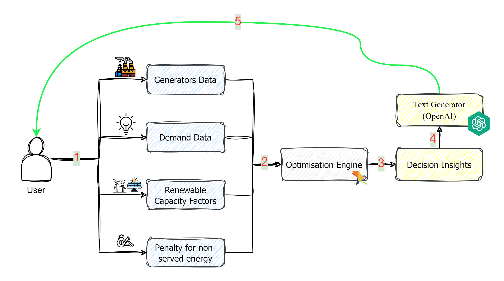

# Electricity Generation Capacity Expansion Model with Decision Insights via OpenAI

This Streamlit application showcases a basic electricity generation capacity expansion model. The primary objective of this model is to minimise fixed and variable costs among a range of generators to match projected future electricity demands. Beyond presenting numerical results, our optimisation engine employs OpenAI's API to interpret outcomes in concise, user-friendly paragraphs. The diagram below illustrates the foundational structure of this model.

## Features

-**Data Import:** Users have the flexibility to import their own data in CSV format or utilise default values provided within the model.

-**Solver:** The model employs Pyomo and utilises the GLPK solver to efficiently solve the optimisation problem.

-**Decision Insights:** After the optimisation process, the outputs are passed through the OpenAI API. This API interprets the results and presents users with a brief paragraph summarizing the decisions made by the model.

## Libraries Used

- Streamlit: For web development and user interface
- Pyomo: For optimisation modeling
- Plotly: For graphical representations
- Pandas and NumPy: For data manipulation and computation

## Usage

To run the app:

1. Ensure Python and the required libraries are installed.
2. Clone the repository.
3. Install necessary dependencies (`pip install -r requirements.txt`).
4. Run the Streamlit app (`streamlit run app.py`).
5. Explore the model using either default values or by importing your own data.

Feel free to contribute, raise issues, or suggest enhancements to this project.
